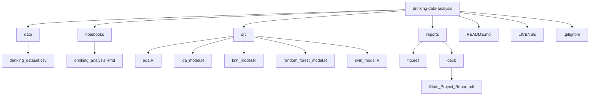

# Statistical-Analysis-on-Alcohol-Data

## 📌 Project Overview
This project analyzes data from the **National Health Insurance Service in Korea** to predict whether a person drinks alcohol based on demographic, lifestyle, and health-related factors.  
We applied several classification models—**LDA (Linear Discriminant Analysis)**, **KNN (k-Nearest Neighbors)**, **Random Forest**, and **SVM (Support Vector Machine)**—and compared their performance using accuracy, confusion matrices, and error rates.  
The analysis highlights key risk factors such as smoking status, cholesterol levels, and serum creatinine, which are often associated with drinking behavior.

---

## 🎯 Objectives
- Explore the dataset and visualize demographic/health-related differences between drinkers and non-drinkers.
- Train and evaluate multiple classification models to predict drinking status (`DRK_YN`).
- Compare model performance using accuracy, sensitivity, specificity, and error rates.
- Identify the most reliable model for predicting alcohol consumption.
- Provide recommendations for improving model performance and addressing class imbalance.

---

## 🗃️ Dataset
- **Source:** [Kaggle Smoking & Drinking Dataset](https://www.kaggle.com/datasets/sooyoungher/smoking-drinking-dataset)  
- **Size:** 1,000 rows × 24 features  
- **Type:** Tabular (mixed demographic, lifestyle, biochemical, and medical attributes)  
- **Target Variable:** `DRK_YN` (1 = drinks, 0 = does not drink)  

### Key Features
- **Demographics:** Sex, Age, Height, Weight, Waistline  
- **Lifestyle:** Smoking status (`SMK_stat_type_cd`)  
- **Medical:** Vision, Hearing, Blood pressure (SBP/DBP), Blood sugar, Cholesterol (HDL, LDL, Total), Triglycerides, Hemoglobin  
- **Biochemical markers:** Serum Creatinine, Liver enzymes (SGOT/AST, SGOT/ALT, Gamma-GTP)  

---

## 📊 Exploratory Data Analysis (EDA)
- **Summary Statistics:** Found imbalances—more non-drinkers than drinkers.  
- **Boxplots:**  
  - Drinkers vs Non-Drinkers showed little difference in SBP and Serum Creatinine.  
  - Cholesterol distribution wider among drinkers (more outliers).  
- **Bar Charts:**  
  - Women are more likely to be non-drinkers.  
  - Current smokers are more likely to be drinkers.  

---

## 🧪 Models Applied

### 1. Linear Discriminant Analysis (LDA)
- **Accuracy:** ~73%  
- **Error Rate:** 0.27  
- **Insights:**  
  - Drinkers had higher height, weight, cholesterol, and smoking prevalence.  
  - Key discriminators: Sex, Smoking, Serum Creatinine, and Hearing ability.  

### 2. k-Nearest Neighbors (KNN)
- **Best k:** 16  
- **Accuracy:** ~62.5%  
- **Insights:** Struggled with overlapping data distributions. Performed better at identifying drinkers (class “1”) but weaker for non-drinkers.  

### 3. Random Forest
- **Accuracy:** ~70.5%  
- **Error Rate:** 0.3162  
- **Insights:** More robust than KNN; higher specificity (detecting drinkers). Performed better at identifying class “1” than class “0.”  

### 4. Support Vector Machine (SVM)
- **Accuracy:** ~64%  
- **Insights:**  
  - Built decision boundaries using hemoglobin and LDL-cholesterol for visualization.  
  - Needed many support vectors (675), indicating overlap between classes.  

---

## 📌 Key Insights
1. **Random Forest** provided the most stable and reliable results despite not having the absolute highest accuracy.  
2. **LDA** achieved the highest accuracy (73%) but struggled with overlapping groups.  
3. **KNN** and **SVM** underperformed due to difficulty separating classes with overlapping features.  
4. Drinkers tend to have higher **cholesterol levels, weight, and smoking prevalence.**  
5. Data imbalance between drinkers and non-drinkers likely reduced performance.  

---

## ✅ Recommendations
- Apply **SMOTE or class weighting** to address imbalance between drinkers vs non-drinkers.  
- Explore **Gradient Boosting Models (GBM/XGBoost)** for potentially better performance.  
- Use **10-fold cross-validation** instead of a single train-test split for robustness.  
- Consider **feature engineering** to better capture nonlinear effects.  

---

## 🛠️ Tools & Technologies
- **Language:** R  
- **Libraries:** `MASS`, `class`, `randomForest`, `e1071`, `ggplot2`  
- **Workflow:**  
  - Data preprocessing & visualization → Model training → Performance evaluation → Comparative analysis  

---

## 📂 Repository Structure 

---
## 📜 License

- This project is licensed under the MIT License.

## 🙏 Acknowledgments

- Dataset provided by Sooyoung Her on Kaggle.
- Guidance and support from faculty and peers.
